# Anime Sketch Colorization with U-Net

A deep learning project that automatically colorizes anime sketches using a custom U-Net architecture. The model takes grayscale sketches and color scribbles as input to generate fully colorized anime characters.

## Overview

This project implements an end-to-end pipeline for anime sketch colorization using PyTorch. The model uses a 4-channel input (1 grayscale sketch + 3 RGB color scribbles) and produces a 3-channel RGB colorized output.

### Sample Results

| Input Sketch                        | Color Scribbles                            | Ground Truth                                  | Model Output                         |
|-------------------------------------|--------------------------------------------|-----------------------------------------------|--------------------------------------|
| 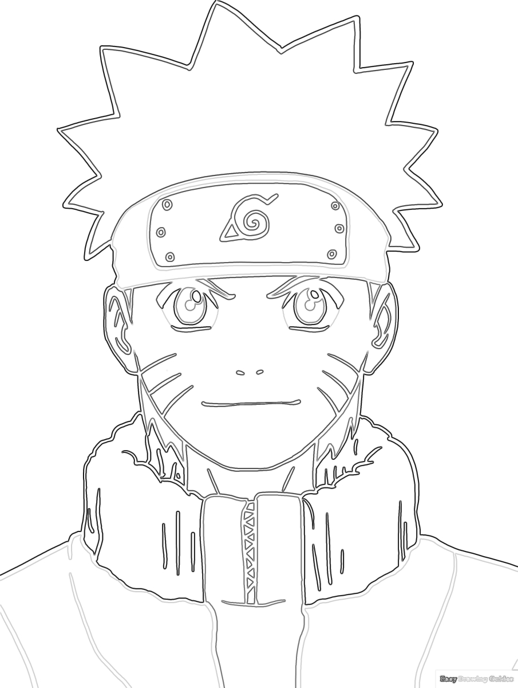 | 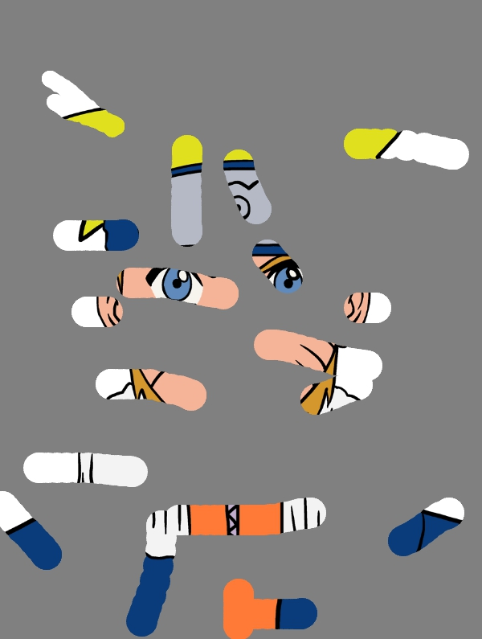 | 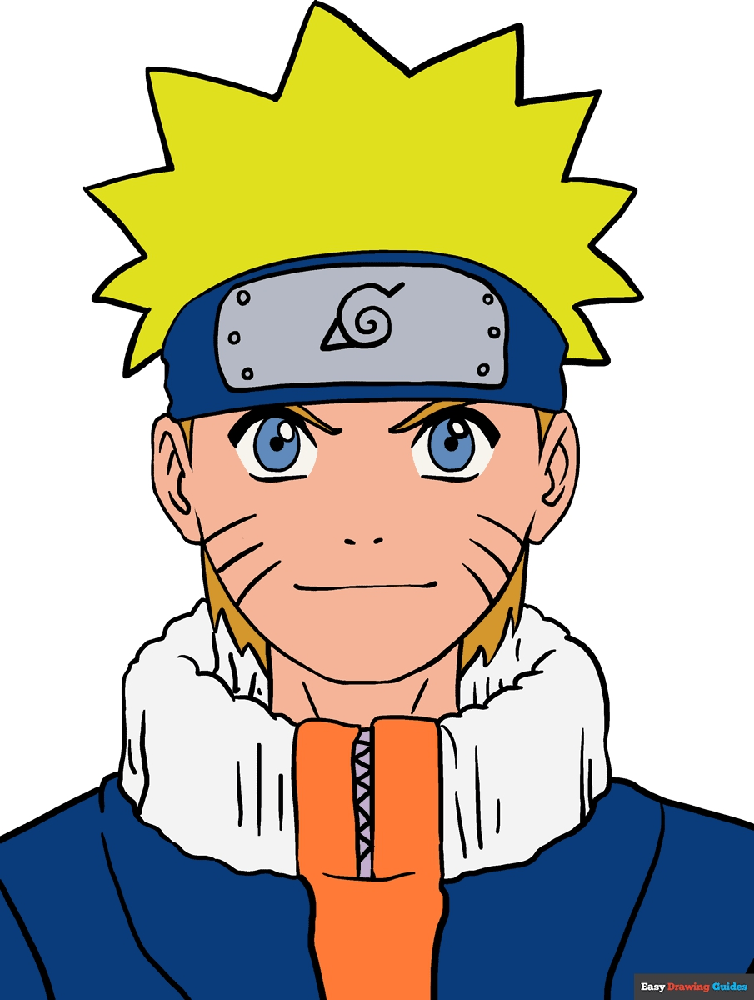 | 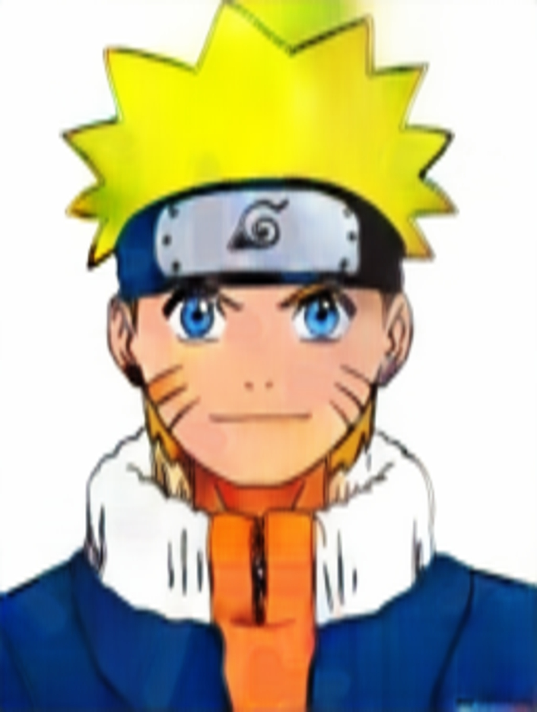 |
| 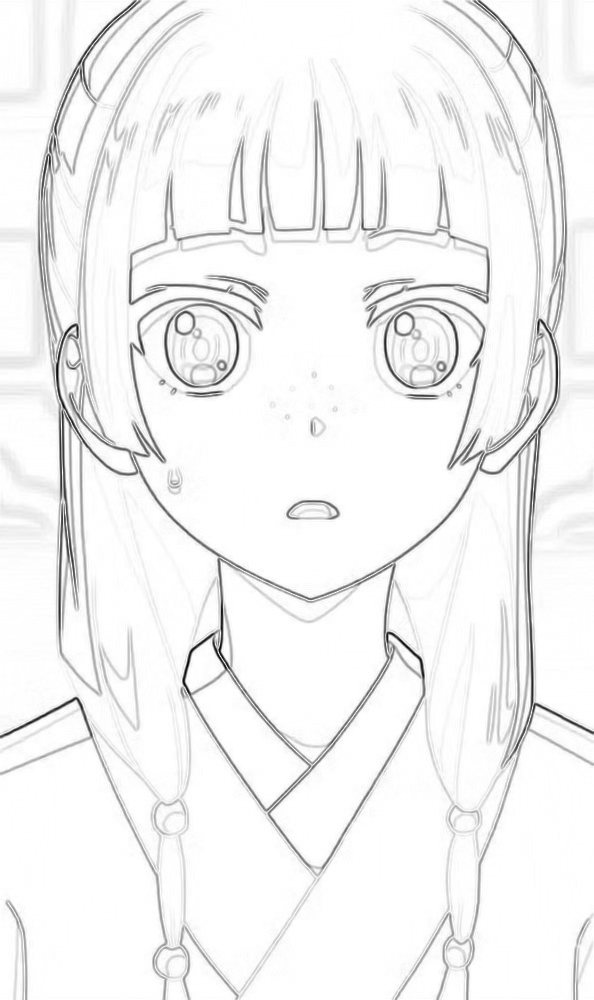 | 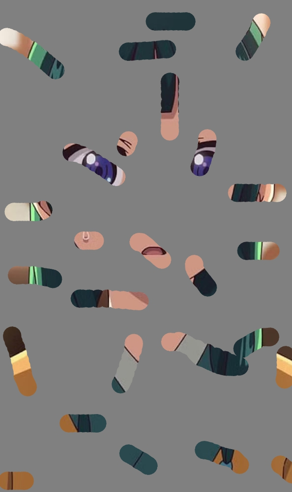 | 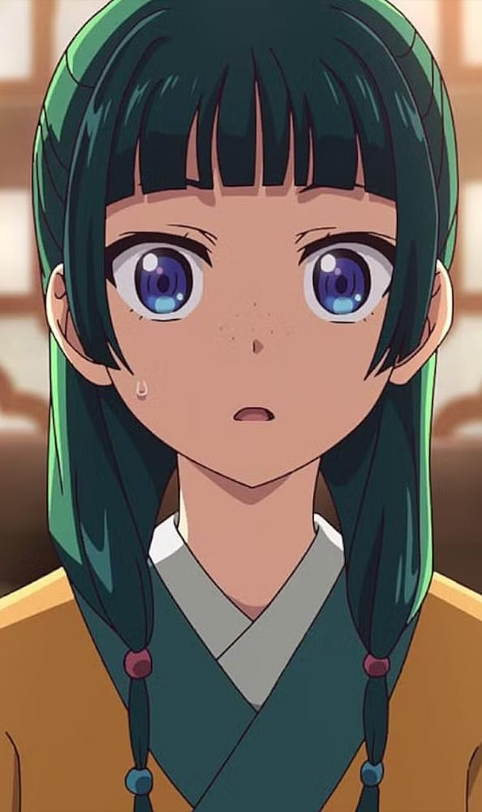 | 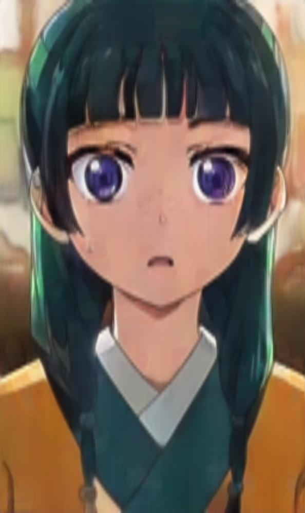|
| 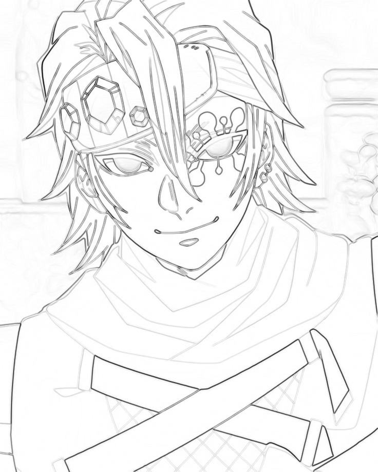   | 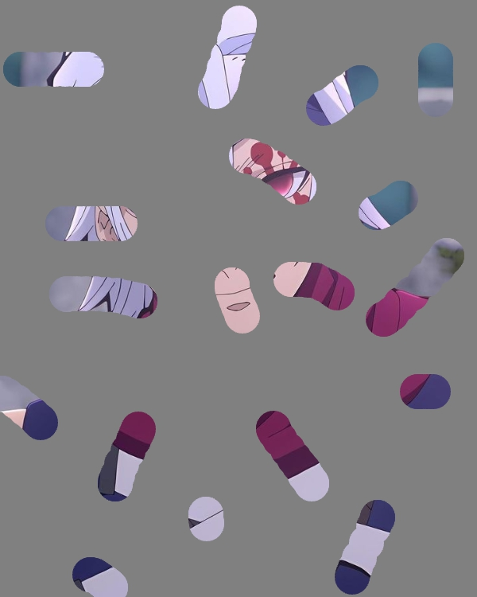 | 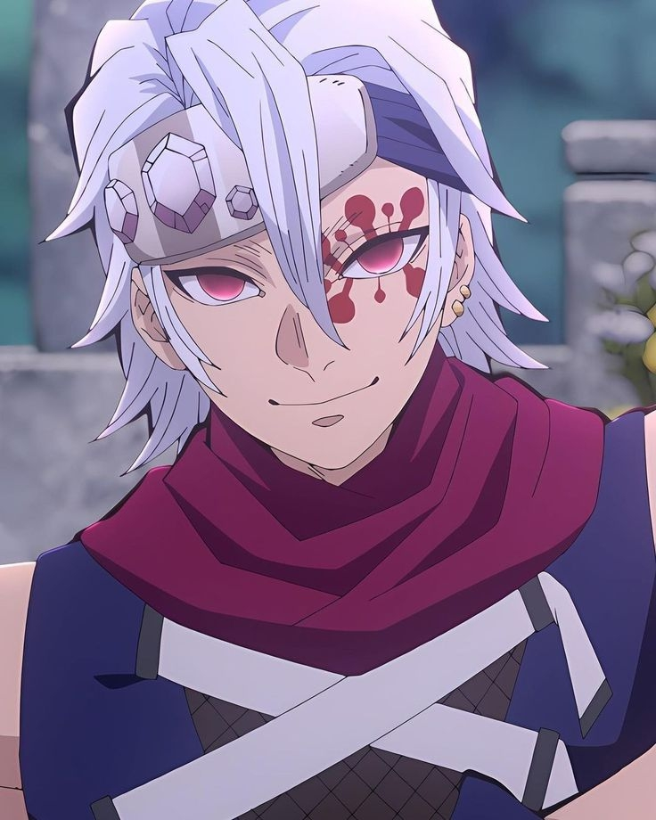 | 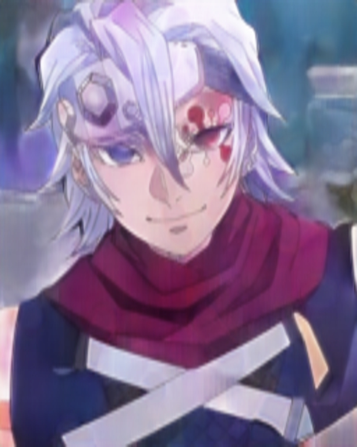|

## Architecture

The model uses a U-Net architecture with:
- **Encoder**: 4 convolutional blocks with max pooling (64 → 128 → 256 → 512 channels)
- **Bottleneck**: 1024-channel processing layer
- **Decoder**: 4 upsampling blocks with skip connections
- **Input**: 4 channels (1 grayscale sketch + 3 RGB scribbles)
- **Output**: 3 channels (RGB colorized image)
- **Image Size**: 160×256 pixels

## Training Results

The model was trained for 57 epochs with the following performance:
- **Initial Loss**: 0.1946 (Epoch 1)
- **Final Loss**: 0.0084 (Epoch 57)
- **Loss Reduction**: 95.7%
- **Dataset Size**: 20,000 samples from [anime_diffusion_full](https://huggingface.co/datasets/pawlo2013/anime_diffusion_full)

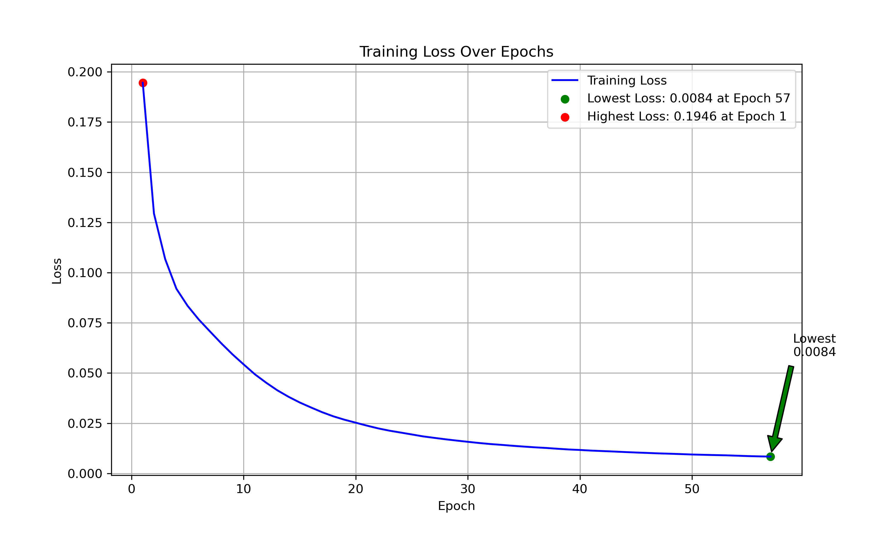

## Installation

```bash
# Clone the repository
git clone https://github.com/yourusername/anime-sketch-colorization
cd anime-sketch-colorization

# Install dependencies
pip install -r requirements.txt
```

### Requirements

```
torch>=1.9.0
torchvision>=0.10.0
PIL>=8.3.0
matplotlib>=3.4.0
numpy>=1.21.0
pandas>=1.3.0
datasets>=1.12.0
tqdm>=4.62.0
```

## Dataset

The project uses the [anime_diffusion_full dataset](https://huggingface.co/datasets/pawlo2013/anime_diffusion_full) which contains:
- Original anime images
- Corresponding sketches
- Color scribbles
- Sketch+scribbles merged images

### Data Processing Pipeline

1. **Download**: Automatically downloads from HuggingFace datasets
2. **Validation**: Checks image integrity and size constraints
3. **Standardization**: Resizes all images to 160×256 pixels
4. **Normalization**: Applies mean=[0.5, 0.5, 0.5], std=[0.5, 0.5, 0.5]

## Key Features

- **End-to-end Pipeline**: Complete data processing, training, and inference workflow
- **Robust Data Handling**: Validates 20K+ images with comprehensive error handling
- **Skip Connections**: U-Net architecture preserves fine details through skip connections
- **Flexible Input**: Handles both file paths and PIL images
- **Visualization Tools**: Built-in functions for comparing results
- **Checkpointing**: Automatic model saving during training

## Technical Details

### Model Architecture
- **Total Parameters**: ~31M parameters
- **Memory Usage**: ~4GB GPU memory for batch size 16
- **Training Time**: ~8 hours on TPU for 57 epochs
- **Loss Function**: Mean Squared Error (MSE)
- **Optimizer**: Adam with learning rate 1e-4

### Data Augmentation
- Resize to 160×256 pixels
- Normalize to [-1, 1] range
- Convert sketches to single-channel grayscale
- Combine sketch + scribbles into 4-channel input

## Results Analysis

The model demonstrates strong learning capability:
- Rapid initial convergence (50% loss reduction in first 10 epochs)
- Stable training without overfitting
- Consistent improvement across all 57 epochs
- Final loss of 0.0084 indicates good reconstruction quality

## Contributing

1. Fork the repository
2. Create your feature branch (`git checkout -b feature/amazing-feature`)
3. Commit your changes (`git commit -m 'Add amazing feature'`)
4. Push to the branch (`git push origin feature/amazing-feature`)
5. Open a Pull Request

## License

This project is licensed under the MIT License - see the [LICENSE](LICENSE) file for details.

## Acknowledgments

- Dataset: [anime_diffusion_full](https://huggingface.co/datasets/pawlo2013/anime_diffusion_full) by pawlo2013
- Architecture inspiration: U-Net paper by Ronneberger et al.
- Framework: PyTorch team for the excellent deep learning framework

## Citation

If you use this work in your research, please cite:

```bibtex
@misc{anime-sketch-colorization,
  title={Anime Sketch Colorization with U-Net},
  author={Your Name},
  year={2025},
  url={https://github.com/yourusername/anime-sketch-colorization}
}
```